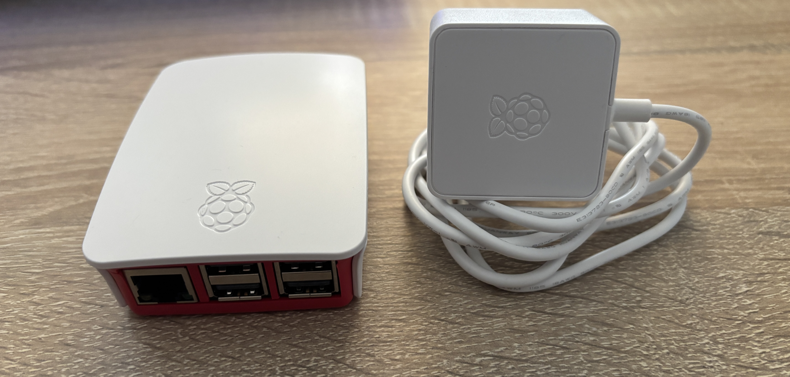
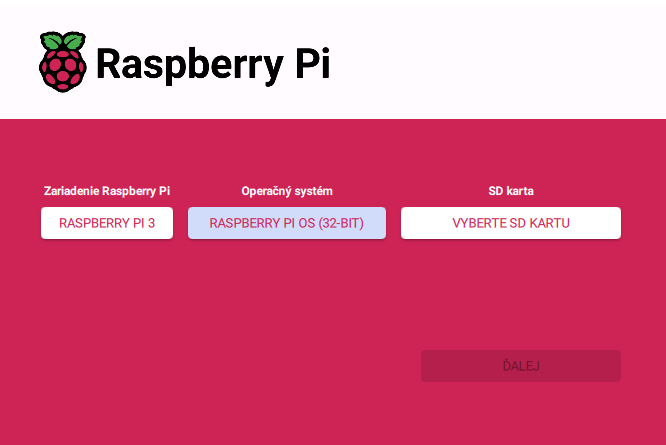

# NetSentinel
Mini projekt pre zariadenie Raspberry Pi, ktorý funguje na princípe IDS. Aplikácia monitoruje podozrivú sieťovú aktivitu na Raspberry Pi, zobrazuje bezpečnostné alerty v termináli a zároveň ich odosiela ako notifikácie na Discord server pomocou webhooku.

## Príprava prostredia
Pred samotným vytvorením aplikácie je potrebné využívať virtuálne prostredie `venv` v priečinku NetSentinel.
- `python3 -m venv venv`
- `source venv/bin/activate`
- Vytvorte textový dokument `touch requirements.txt`, otvorte cez napr. `nano requirements.txt` a napíšte knižnicu `scapy`, `requests` a `python-dotenv`.
- Teraz ju nainštalujte `pip install -r requirements.txt`.
- Spustenie `python3 main.py`.

## Príprava Discord servera
- Vytvorte nový discord server, ktorý pomenujete napr. `Raspberry Alerts`.
- Vytvorte Text roomku `Alerts`.
- V rámci roomky `Alerts` prejdite do `Edit channel` ->  `Integrations` -> `Webhooks` a vytvorte novy Webhook. 
- Vytvorte súbor `.env` a vložte do neho `DISCORD_WEBHOOK_URL = URL_LINK_DC_ROOMKY`.

## Komunikácia s Raspberry Pi
- Keďže nepoužívame LCD displej ani monitor, potrebujeme mať aktívny port 22 (SSH), ku ktorému sa budeme pripájať pomocou nástroja `Putty`.
- Pre SSH prístup na RPi sme nastavili bezpečnostné opatrenia v konfiguračnom súbore SSH a tiež sme nakonfigurovali firewall tak, aby bol prístup povolený len z konkrétnych IP adries.

## Funkcie 
- `Detekcia ARP Spoofingu`
- `Detekcia port scanningu`
- `Zoznam aktívnych zariadení v sieti`
- `Detekcia ping floodu (ICMP)`

## Funkcia modulov
- `arp_spoofing.py` - Ak zachytí ARP reply, kde sa MAC adresa líši od tej, ktorá bola pôvodne zaznamenaná pre danú IP, vyvolá alert – potenciálny ARP spoofing útok. Príklad použitia: `arpspoof -i eth0 -t <IP_RPI> <IP_Gateway>`, pričom `-i` môže byť aj napr. `wlan0`.
- `scanner_detect.py` - Detekcia skenovania zariadenia. Príklad použitia: `nmap -sS -sV <sieťova_adresa/veľkost_podsiete>`. Príkaz na zistenie podsiete `ip a`.
- `device_scanner.py` - Zoznám aktuálnych zariadení na sieti.
- `ping_flood.py` - Detekcia zahltenia požiadaviek typu `ping` v krátkom časovom intervale. Príklad otestovanie: `ping -f <IP_RPI>`.

## Využitý hardware
- `Raspberry Pi 3`
- `Micro SD karta 16 GB`
- `Napájací adapter 5V 2.5A micro USB`

  
   
  <i>Obrázok 1 Raspberry Pi 3</i>

## Grafický postup a testovanie
- Ako prvé potrebujeme nainštalovať Raspberry Pi OS na SD kartu, prostredníctvom RPi Imageru, ktorý je dostupný na: `https://www.raspberrypi.com/software/`
- Pre náš projekt sme zvolili zariadenie `RPi 3` a OS `32-bit`.
  

  
   
  <i>Obrázok 2 RPi Imager 3</i>

## Vylepšenia do budúcnosti 
- Zachytávanie podozrivej aktivity aj na iné zariadenia ako RPI, prostredníctvom WLAN adaptéru, ktorý umožňuje monitor mode (chipset `Atheros AR9271`).
- Pridanie 3.5″ LCD displeju pre vizuálne zobrazenie upozornení.

## Poznámky
- Projekt slúži na vzdelávacie účely v oblasti kybernetickej bezpečnosti.
